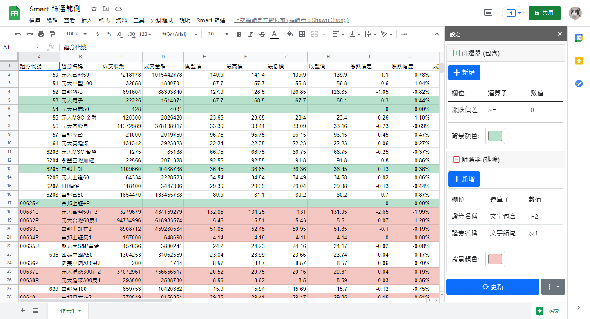
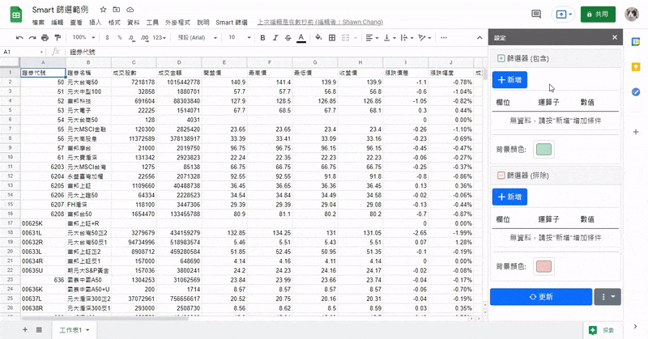

# Google Apps Script: Smart 篩選

Google Sheets 中如何把一些資料用顏色區別? 我們會用 "條件式格式設定" (Conditional formatting)，但是一些剪下貼上的動作經常會把條件式設定的範圍給弄壞，這在 Excel 也經常發生。

加上我也經常需要修改條件，傳統的 "條件式格式設定" 要修改數值真的很麻煩。

所以我就做了一個簡易側欄 (sidebar) 來做篩選的工具，也當作是 JavaScript 練習。

## 特色

- 可以用在任何 Table 格式的資料
- 井然有序的看到篩選條件
- 每次開表單或更新資料時都會更新
- 可以自訂篩選的背景顏色
- 每個工作表都有自己的設定

因為這個 project 比較偏程式練習和留給大家一個 Google Apps Script 的範例，範圍目前無法客製化。因為 GUI 上好像找不太到地方擺了，加上使用情境通常都是想要篩選一列一列的資料，現在的篩選條件除了第一列以外所有資料都會被套用。

## 安裝方式

1. 開啟一個 Google Sheets 試算表
2. 將想篩選的資料匯入到目前的工作表
3. 點上方選單 "工具" -> "指令碼編輯器"
4. 將 `files/` 內的檔案依照下面的順序 (**注意順序非常重要**) 加入到 Apps Script 的 "檔案" 中，`.js` 檔案請新增 "指令碼"、`.html` 檔案請新增 "HTML"
    1. `settings_manager.gs`
    2. `formatter.gs`
    3. `main.gs`
    4. `html_api.gs`
    5. `settings_sidebar_styles.html`
    6. `settings_sidebar_scripts.html`
    7. `settings_sidebar.html`
5. 回到試算表，重新整理 Google Sheets 網頁
6. 等一陣子後會看到上方選單多一個 "Smart 篩選" 選單，點 "Smart 篩選" -> "設定" 開始使用

## Demo

## Google Sheets 試算表範例

你可以複製一份上面螢幕截圖的 [範例 Google Sheets 試算表](https://docs.google.com/spreadsheets/d/1LT0GQB9W7cBJzsAEk4jkWN03Q2HU-qkmq9b4ZqBT6dw/edit?usp=sharing) 來試玩看看。

資料來源: [政府資料開放平臺: 盤後資訊 > 個股日成交資訊](https://data.gov.tw/dataset/11549)

## 使用到的 Libraries

- [jQuery 3](https://jquery.com/)
- [Bootstrap 5](https://getbootstrap.com/)
- [DataTables](https://datatables.net/)

## 開發環境

- Windows 10
- Chrome
- Visual Studio Code
    - [ESLint](https://marketplace.visualstudio.com/items?itemName=dbaeumer.vscode-eslint)
    - [Prettier](https://marketplace.visualstudio.com/items?itemName=esbenp.prettier-vscode)
